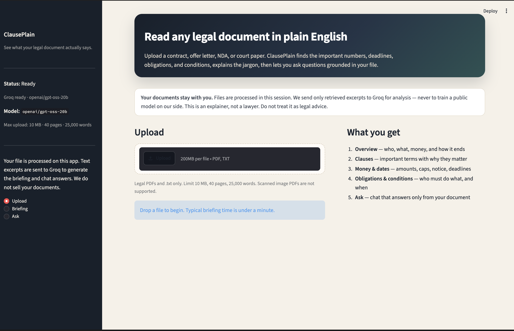
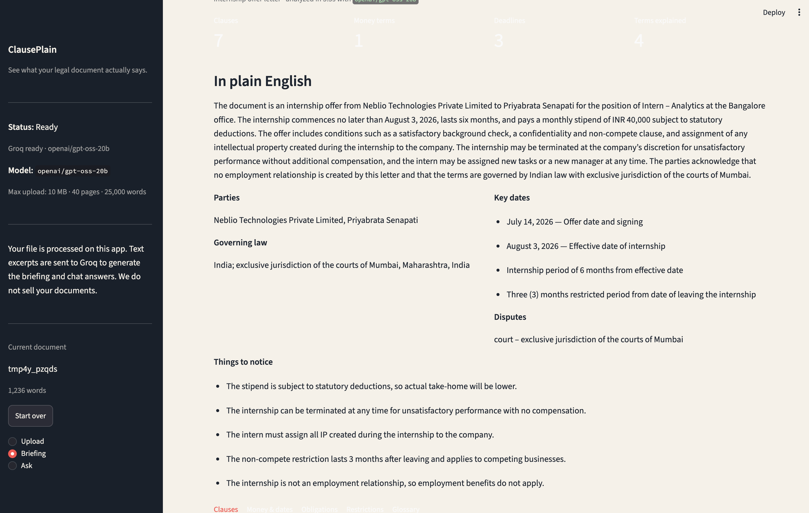

# 📄 ClausePlain

Upload a **contract, offer letter, NDA, court paper, or similar legal file** and get a plain-English briefing with the numbers and deadlines that matter. Ask questions, and get answers sourced strictly from the uploaded file.

> ⚠️ **Disclaimer:** This tool is for informational purposes only. It is **not legal advice**.


### 📸 See it in action



*Left: Automated plain-English briefing. Right: Document-specific Q&A.*

---


## 🚀 Features: What the Briefing Extracts

ClausePlain automatically parses legal text to surface the most critical information:

- **Core Details:** Parties, dates, and governing law.
- **Financials:** Salary, fees, caps, and percentages.
- **Timelines:** Notice periods, term lengths, and probation limits.
- **Legal Mechanics:** Obligations, conditions, rights, and restrictions.
- **Context:** Clause-level “why it matters” breakdowns.
- **Glossary:** Plain-English translations of complex legal jargon.


## 🛠 Tech Stack & LLM

- **Language/Framework:** Python 3.11 · Streamlit
- **Vector & Embedding:** Chroma · BGE-small
- **LLM Engine:** Groq 
- **Models:** 
  - Default: `openai/gpt-oss-20b` (fastest open model on a free key)
  - Fallback: `openai/gpt-oss-120b` (used if the 20B model is rate-limited)
  - *Note: Llama 3.x IDs on Groq are often restricted to enterprise.*


## ⚖️ File Limits & Safeguards

To maintain performance and relevance, ClausePlain enforces the following upload constraints:


| Rule           | Limit                               |
| -------------- | ----------------------------------- |
| **File size**  | 10 MB                               |
| **PDF pages**  | 40                                  |
| **Words**      | 25,000                              |
| **File types** | PDF (text) or `.txt`                |
| **Content**    | Must look like a **legal document** |


*Uploads that fail these checks are rejected before analysis. Non-legal files (e.g., recipes, essays) will return a **Not a legal document** error.*

---


## 💻 Run Locally

**1. Set up the environment**

```bash
python3.11 -m venv .venv
source .venv/bin/activate
pip install -r requirements.txt
```

**2. Configure API keys**

```bash
cp .env.example .env
# Open .env and paste your GROQ_API_KEY from [https://console.groq.com/keys](https://console.groq.com/keys)
```

**3. Run the Streamlit app**

```bash
streamlit run app.py
```

**4. Run CLI analysis or Tests**

```bash
python main.py analyze path/to/document.pdf
pytest tests/ -q
```

*(Note: Live Groq smoke tests run only when* `GROQ_API_KEY` *is set.)*

---


## 🔒 Privacy

Your documents are treated with strict privacy in mind:

- **Storage:** Files stay on the host server that runs the app. 
- **Processing:** Only the specific, retrieved text excerpts necessary to generate the briefing or answer your query are sent to the Groq API.

